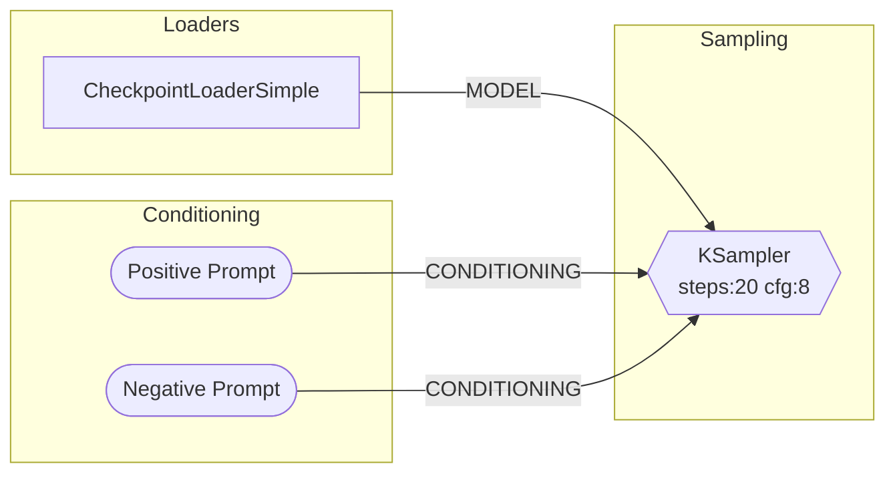

# comfyui-mcp — the Claude Code plugin for ComfyUI

**Claude Code plugin + MCP server for [ComfyUI](https://github.com/comfyanonymous/ComfyUI)** — generate images and video, execute and author workflows, manage models and custom nodes, and **edit your live ComfyUI graph from your Claude session** ([sidebar panel](https://github.com/artokun/comfyui-mcp-panel), zero API keys).

[](https://www.npmjs.com/package/comfyui-mcp)
[](https://nodejs.org)
[](./LICENSE)
[](https://comfyui-mcp.artokun.io/docs)

[](https://glama.ai/mcp/servers/artokun/comfyui-mcp)
[](https://glama.ai/mcp/servers/artokun/comfyui-mcp)

Works on **macOS**, **Linux**, and **Windows**. Auto-detects your ComfyUI installation and port.

**89 MCP tools** | **16 AI skills** (Flux · WAN · LTX video · Qwen · Z-Image · model registry · Civitai · node authoring) | **11 slash commands** | **4 autonomous agents** | **4 hooks**

The plugin ships **expert skills that grow with every release** — model-specific generation guides with curated download URLs, workflow recipes, troubleshooting, and custom-node authoring — so Claude knows the right sampler, CFG, resolution, and model files for each architecture without trial and error.

> ### 🚧 Coming soon: the [ComfyUI MCP Panel](https://github.com/artokun/comfyui-mcp-panel) on ComfyUI-Manager & the Comfy Registry
> Claude in your ComfyUI sidebar — live graph edits, activity cards, multi-tab, zero API keys.
> v0.3 is in final testing. [Read more →](https://comfyui-mcp.artokun.io/docs/panel)

📖 **Full documentation: [comfyui-mcp.artokun.io/docs](https://comfyui-mcp.artokun.io/docs)**

---

## Quick Start

**1. Install ComfyUI** (if you haven't already): [ComfyUI Desktop](https://www.comfy.org/download) or [from source](https://github.com/comfyanonymous/ComfyUI)

**2. Add the MCP server** to your Claude Code config (`~/.claude/settings.json`):

```json
{
  "mcpServers": {
    "comfyui": {
      "command": "npx",
      "args": ["-y", "comfyui-mcp"],
      "env": {
        "CIVITAI_API_TOKEN": ""
      }
    }
  }
}
```

**3. Start using it.** With ComfyUI running, ask Claude to generate an image:

```
> Generate an image of a sunset over mountains
```

Claude will find (or download) a checkpoint, build a workflow, execute it, and return the image.

> **Note**: This runs as a standalone MCP server — no need to clone this repo. `npx` will download and run it automatically.

### Scope: local, remote, or Comfy Cloud

`comfyui-mcp` is the community MCP for **local** and **remote** ComfyUI (Mac/Linux/Windows installs, RunPod, VPS, LAN, etc.) — that's the primary target.

For **Comfy Cloud** users, [Comfy-Org ships an official Comfy Cloud MCP](https://docs.comfy.org/development/cloud/mcp-server) (currently invite-only beta) which is cloud-exclusive and maintained by the Comfy team. `comfyui-mcp` *also* includes a community cloud-mode (set `COMFYUI_API_KEY` — see [Deployment modes](#deployment-modes)) so a single MCP can target all three deployment shapes from one config; pick whichever fits your workflow.

---

## Claude Code Plugin

This package also ships as a **Claude Code plugin**, providing slash commands, skills, agents, and hooks on top of the MCP tools.

### Install as a plugin

```bash
# In Claude Code
/plugin marketplace add artokun/comfyui-mcp
/plugin install comfy
```

### Slash commands

| Command | Description |
|---------|-------------|
| `/comfy:gen <prompt>` | Generate an image from a text description — auto-selects checkpoint, builds workflow, returns image |
| `/comfy:viz <workflow>` | Visualize a workflow as a Mermaid diagram with nodes grouped by category |
| `/comfy:node-skill <pack>` | Generate a Claude skill for a custom node pack from Registry ID or GitHub URL |
| `/comfy:debug [prompt_id]` | Diagnose why a workflow failed — reads history, logs, traces root cause, suggests fixes |
| `/comfy:batch <prompt, params>` | Parameter sweep generation across cfg, sampler, steps, seed, etc. |
| `/comfy:convert <file>` | Convert between UI format and API format workflows |
| `/comfy:install <pack>` | Install a custom node pack — git clone, pip install, optional restart |
| `/comfy:gallery [filter]` | Browse generated outputs with metadata — filter by date, count, or filename |
| `/comfy:compare <a vs b>` | Diff two workflows side by side — shows added/removed nodes and changed parameters |
| `/comfy:recipe <name> <prompt>` | Multi-step recipes: `portrait`, `hires-fix`, `style-transfer`, `product-shot` |

### Built-in skills

16 skills total — model-family guides (Flux, WAN, LTX, Qwen, Z-Image), the **model-registry** (curated download URLs), the **civitai** pairing skill, node authoring, and the core four below. Full list on the [plugin docs page](https://comfyui-mcp.artokun.io/docs/plugin).

| Skill | Description |
|-------|-------------|
| **comfyui-core** | Workflow format, node types, data flow patterns, pipeline architecture, MCP tool usage guide |
| **prompt-engineering** | CLIP weight syntax `(word:1.3)`, BREAK tokens, embeddings, model-specific prompting for SD1.5/SDXL/Flux/SD3 |
| **troubleshooting** | Common error catalog — OOM, dtype mismatches, missing nodes, NaN tensors, black images, CUDA errors, with VRAM estimates per model |
| **model-compatibility** | Compatibility matrix — loaders, resolutions, CFG, samplers, ControlNets, LoRAs, and VAEs per model family (SD1.5/SDXL/Turbo/Lightning/Flux/SD3/LTXV) |

### Agents

| Agent | Model | Description |
|-------|-------|-------------|
| **comfy-explorer** | Sonnet | Researches custom node packs — reads docs, queries `/object_info`, generates comprehensive skill files |
| **comfy-debugger** | Sonnet | Autonomously diagnoses workflow failures — gathers logs + history, identifies failing node, checks models + custom nodes, proposes and optionally applies fixes |
| **comfy-optimizer** | Sonnet | Analyzes workflows for performance — detects redundant nodes, VRAM waste, wrong CFG/steps for model family, precision issues, suggests optimizations |

### Hooks

| Event | Trigger | Action |
|-------|---------|--------|
| PreToolUse | `enqueue_workflow` | **VRAM watchdog** — checks GPU memory via `/system_stats` and warns if < 1GB free before execution |
| PreToolUse | `stop_comfyui`, `restart_comfyui` | **Save warning** — prompts user to save unsaved workflow changes before stopping ComfyUI |
| PostToolUse | Any comfyui tool | **Job completion notify** — checks for completed jobs and injects completion summaries into the conversation |

### Background Scripts

| Script | Description |
|--------|-------------|
| `monitor-progress.mjs` | **Progress monitor** — connects to ComfyUI's WebSocket for real-time step progress (e.g., `step 5/14 (36%)`). Run as a background Bash task after enqueuing workflows. Reports completion with output filenames, errors with node details. Replaces polling `get_job_status` in a loop. |

---

## MCP Tools

47 tools across workflow execution, generation, iteration, composition, models, and more:

### Image Generation (high-level)

| Tool | Description |
|------|-------------|
| `generate_image` | Generate from a text prompt — builds a txt2img workflow, fills unspecified params from your defaults, auto-selects a checkpoint |
| `generate_with_controlnet` | Generate conditioned by a ControlNet image (pose/depth/canny/normal) + prompt |
| `generate_with_ip_adapter` | Generate guided by a reference image's style/subject via IP-Adapter (needs ComfyUI_IPAdapter_plus) |

### Audio Generation (high-level)

| Tool | Description |
|------|-------------|
| `generate_audio` | Generate audio from a text prompt — supports ACE Step 1.5 (music with lyrics/structure) and Stable Audio 3 (music, instruments, SFX); auto-selects local models |

### Assets & Iteration

| Tool | Description |
|------|-------------|
| `view_image` | Return a generated asset's bytes as an inline image so the agent can see the result |
| `regenerate` | Re-run the workflow that produced an `asset_id`, with optional parameter overrides |
| `list_assets` | Browse recently generated assets (newest-first) by `asset_id` |
| `get_asset_metadata` | Full provenance for an asset, including the originating workflow |

### Defaults

| Tool | Description |
|------|-------------|
| `get_defaults` | Show merged generation defaults with per-source attribution |
| `set_defaults` | Update runtime defaults; `persist: true` writes the config file |

### Workflow Execution

| Tool | Description |
|------|-------------|
| `enqueue_workflow` | Submit a workflow (API format JSON) — returns `prompt_id` immediately, non-blocking |
| `get_job_status` | Check execution status of a job by prompt ID |
| `get_queue` | View the current execution queue (running + pending) |
| `cancel_job` | Interrupt the currently running job |
| `get_system_stats` | Get system info — GPU, VRAM, Python version, OS |

### Workflow Visualization

| Tool | Description |
|------|-------------|
| `visualize_workflow` | Convert a workflow to a Mermaid flowchart with nodes grouped by category |
| `mermaid_to_workflow` | Convert a Mermaid diagram back to executable workflow JSON |

### Workflow Composition

| Tool | Description |
|------|-------------|
| `create_workflow` | Generate a workflow from templates: `txt2img`, `img2img`, `upscale`, `inpaint`, `controlnet`, `ip_adapter`, `ace_step_15`, `stable_audio_3` |
| `modify_workflow` | Apply operations: `set_input`, `add_node`, `remove_node`, `connect`, `insert_between` |
| `get_node_info` | Query available node types from ComfyUI's `/object_info` endpoint |

### Workflow Validation

| Tool | Description |
|------|-------------|
| `validate_workflow` | Dry-run validation — checks missing nodes, broken connections, invalid output indices, missing model files |

### Workflow Library

| Tool | Description |
|------|-------------|
| `list_workflows` | List saved workflows from ComfyUI's user library |
| `get_workflow` | Load a specific saved workflow by filename |
| `save_workflow` | Save a workflow to the ComfyUI user library |

### Image Management

| Tool | Description |
|------|-------------|
| `upload_image` | Copy a local image into ComfyUI's `input/` directory for img2img, inpaint, or ControlNet |
| `workflow_from_image` | Extract embedded workflow metadata from a ComfyUI-generated PNG (reads `prompt` and `workflow` tEXt chunks) |
| `list_output_images` | Browse recently generated images from the output directory, sorted newest-first |

### Model Management

| Tool | Description |
|------|-------------|
| `search_models` | Search HuggingFace for compatible models (checkpoints, LoRAs, VAEs, etc.) |
| `download_model` | Download a model from a URL to the correct ComfyUI subdirectory |
| `list_local_models` | List installed models by type: checkpoints, loras, vae, upscale_models, controlnet, embeddings, clip, unet, diffusion_models, text_encoders |

### Memory Management

| Tool | Description |
|------|-------------|
| `clear_vram` | Free GPU VRAM by unloading cached models — calls ComfyUI's `/free` endpoint, reports before/after stats |
| `get_embeddings` | List installed textual inversion embeddings |

### Registry & Discovery

| Tool | Description |
|------|-------------|
| `search_custom_nodes` | Search the ComfyUI Registry for custom node packs by keyword |
| `get_node_pack_details` | Get full details of a custom node pack (description, author, nodes, install info) |
| `generate_node_skill` | Generate a Claude skill `.md` file from a Registry ID or GitHub URL |

### Diagnostics

| Tool | Description |
|------|-------------|
| `get_logs` | Get ComfyUI server logs with optional keyword filter (e.g., `error`, `warning`, a node name) |
| `get_history` | Get execution history with full error details, Python tracebacks, timing, and cached node info |

### Process Control

| Tool | Description |
|------|-------------|
| `stop_comfyui` | Stop the running ComfyUI process (saves PID and launch args for restart) |
| `start_comfyui` | Start ComfyUI using info saved from a previous stop |
| `restart_comfyui` | Stop and restart ComfyUI, preserving all launch arguments |

### Generation Tracker

| Tool | Description |
|------|-------------|
| `suggest_settings` | Suggest proven sampler/scheduler/steps/CFG settings from local generation history — query by model family, LoRA hash, or text search |
| `generation_stats` | Show local generation tracking statistics — total runs, unique combos, breakdown by model family |

Every `enqueue_workflow` call automatically logs settings to a local SQLite database (`generations.db`). Same settings combos get a `reuse_count` bump instead of duplicates, creating a natural popularity signal. Models and LoRAs are identified by content hash (AutoV2 / SHA256), not filenames — so renamed files still group together.

```bash
# View local stats from the CLI
npm run generations:stats
```

### Model Settings

Community-maintained preset library (`model-settings.json`) with research-backed sampler, scheduler, steps, and CFG values for 10+ model families. User overrides in `model-settings.user.jsonc` (auto-created from template on install, gitignored).

---

## Examples

### Generate an image

```
> /comfy:gen a cyberpunk city at night with neon lights
```

Claude will:
1. Check installed checkpoints (download one if needed)
2. Build a txt2img workflow with your prompt
3. Execute it on ComfyUI
4. Return the generated image

### Visualize a workflow

```
> /comfy:viz ~/workflows/my-workflow.json
```

Produces a Mermaid diagram with nodes grouped by category:



### Debug a failed workflow

```
> /comfy:debug
```

Automatically reads the last execution history and logs, identifies the failing node, checks for missing models or node packs, and suggests a fix.

```
> /comfy:debug abc123-def456
```

Diagnose a specific execution by prompt ID.

### Parameter sweep

```
> /comfy:batch a cat in a field, cfg:5-10:2, sampler:euler,dpmpp_2m
```

Generates a grid of images across all parameter combinations and presents a summary table with results.

Supported sweep parameters: `cfg`, `steps`, `sampler`, `scheduler`, `seed`, `denoise`, `width`, `height`.

### Multi-step recipes

```
> /comfy:recipe hires-fix a dramatic fantasy landscape with castles
```

Runs a two-pass pipeline: txt2img at 512x768, then img2img upscale to 1024x1536 with detail enhancement.

Available recipes:

| Recipe | Description |
|--------|-------------|
| `portrait` | Generate at 1024x1024, then 2x upscale to 2048x2048 |
| `hires-fix` | Low-res generation → img2img upscale with denoise 0.4-0.5 |
| `style-transfer` | Apply a style prompt to an existing image via img2img |
| `product-shot` | Product image with clean white background |

### Convert workflow format

```
> /comfy:convert ~/workflows/my-ui-workflow.json
```

Converts between ComfyUI's UI format (nodes + links arrays) and API format (node IDs → {class_type, inputs}).

### Install a custom node pack

```
> /comfy:install comfyui-impact-pack
```

Searches the registry, shows details, clones the repo to `custom_nodes/`, installs dependencies, and offers to restart ComfyUI.

### Browse output gallery

```
> /comfy:gallery last 5
> /comfy:gallery today
```

Lists recent outputs with embedded metadata — shows checkpoint, prompt, seed, steps, CFG, sampler for each image.

### Compare workflows

```
> /comfy:compare workflow-a.json vs workflow-b.json
```

Shows added/removed nodes, changed parameters (old → new values), and optional Mermaid diagrams for visual comparison.

### Validate before running

```
> Validate this workflow before I run it
```

Checks for missing node types, broken connections, invalid output indices, and missing model files — without executing.

### Manage models

```
> What checkpoints do I have installed?
> Search HuggingFace for SDXL turbo models
> Download this model to my checkpoints folder
```

### Manage VRAM

```
> Free my VRAM
> What embeddings do I have?
```

### Extract workflow from an image

```
> Extract the workflow from this image: ~/outputs/ComfyUI_00042_.png
```

Reads the PNG metadata chunks to recover the exact workflow and prompt used to generate the image.

### Explore custom nodes

```
> /comfy:node-skill comfyui-impact-pack
```

Generates a comprehensive skill file documenting every node, its inputs/outputs, and usage patterns.

### Process control

```
> Restart ComfyUI
> Stop ComfyUI
> Start ComfyUI back up
```

---

## Configuration

The server auto-detects your ComfyUI installation and port. Override with environment variables if needed:

### Deployment modes

`comfyui-mcp` operates in one of three modes, auto-selected from the environment:

| Mode | Trigger | Local FS / process tools? |
|------|---------|----------------------------|
| **Local** | default | yes |
| **Remote** | `--comfyui-url` / `COMFYUI_URL` points at a non-loopback host | no — server skips `COMFYUI_PATH` auto-detection so stale local installs can't silently absorb uploads |
| **Cloud** | `COMFYUI_API_KEY` is set (targets [Comfy Cloud](https://cloud.comfy.org)) | no — HTTP primitives route via `cloud.comfy.org` over `X-API-Key`; WebSocket and local-only tools throw `CLOUD_UNSUPPORTED` |

| Variable | Default | Description |
|----------|---------|-------------|
| `COMFYUI_URL` | | Full ComfyUI URL, e.g. `https://comfy.example.com:8443` — overrides `COMFYUI_HOST`/`PORT`/`SSL` and skips auto-detection. Non-loopback hosts opt into **remote mode**. |
| `COMFYUI_HOST` | `127.0.0.1` | ComfyUI server address |
| `COMFYUI_PORT` | *(auto-detect)* | ComfyUI server port (tries 8188, then 8000) |
| `COMFYUI_PATH` | *(auto-detect)* | Path to ComfyUI data directory. Auto-detection suppressed in remote/cloud modes. |
| `COMFYUI_API_KEY` | | Comfy Cloud API key. When set, **cloud mode** is active and the server talks to `cloud.comfy.org`. Never logged. |
| `COMFYUI_CLOUD_URL` | `https://cloud.comfy.org` | Override the Comfy Cloud endpoint (testing/staging). |
| `CIVITAI_API_TOKEN` | | CivitAI API token for model downloads |
| `HUGGINGFACE_TOKEN` | | HuggingFace token for higher API rate limits |
| `GITHUB_TOKEN` | | GitHub token for skill generation (avoids rate limits) |
| `REGISTRY_ACCESS_TOKEN` | | Comfy Registry API key for `publish_custom_node` (env-only, never logged) |
| `COMFYUI_DOWNLOAD_CACHE_DIR` | `~/.comfyui-mcp/cache` | Content-addressed model-download cache (dedup + concurrent coalescing) |
| `COMFYUI_LRU_CACHE_SIZE_GB` | `0` | Cap the download cache in GB; `0` disables LRU eviction |
| `COMFYUI_STARTUP_CHECK_INTERVAL_S` / `…_MAX_TRIES` | `1` / `20` | Readiness-probe interval + max tries when starting a local ComfyUI |
| `COMFYUI_ALWAYS_RESTART` | `false` | Auto-restart a crashed local ComfyUI (bounded by `COMFYUI_RESTART_MAX_ATTEMPTS` / `COMFYUI_RESTART_WINDOW_S`) |
| `LOG_LEVEL` | `info` | Logging verbosity: `debug`, `info`, `warn`, `error` |

### Transports

The server speaks **stdio by default** (what Claude Code, Claude Desktop, and the MCP Inspector expect — no flags needed). For MCP gateways, remote/hosted setups, or `fetch`-based clients, opt into **streamable-HTTP**:

```bash
# stdio (default)
npx -y comfyui-mcp

# streamable-HTTP on http://127.0.0.1:9100/mcp
npx -y comfyui-mcp --http
npx -y comfyui-mcp --http --host 0.0.0.0 --port 9100   # bind/port overrides
```

| Flag | Env | Default | Description |
|------|-----|---------|-------------|
| `--http` / `--transport http` | `MCP_TRANSPORT=http` | `stdio` | Serve streamable-HTTP at `/mcp` instead of stdio |
| `--host <h>` | `MCP_HOST` | `127.0.0.1` | HTTP bind host (use `0.0.0.0` to expose) |
| `--port <n>` | `MCP_PORT` | `9100` | HTTP port |
| `--comfyui-url <url>` | `COMFYUI_URL` | *(auto-detect)* | Target a specific (incl. remote) ComfyUI |

### Remote ComfyUI

Point the server at a ComfyUI running anywhere — no local install required:

```bash
npx -y comfyui-mcp --comfyui-url http://192.168.1.50:8188
npx -y comfyui-mcp --http --comfyui-url https://comfy.example.com:8443
```

### Auto-detection

**Port**: Probes `8188` (CLI default) then `8000` (Desktop app default) via `/system_stats`.

**Path**: Checks common locations in order:

- `~/Documents/ComfyUI` (macOS/Windows Desktop app data directory)
- `~/Library/Application Support/ComfyUI` (macOS)
- `~/AppData/Local/Programs/ComfyUI/resources/ComfyUI` (Windows Desktop app install)
- `~/AppData/Local/ComfyUI` (Windows)
- `~/ComfyUI`, `~/code/ComfyUI`, `~/projects/ComfyUI`, `~/src/ComfyUI`
- `/opt/ComfyUI`, `~/.local/share/ComfyUI` (Linux)
- Scans `~/Documents` and `~/My Documents` for any directory containing "ComfyUI"

Set `COMFYUI_PATH` to skip detection and use an explicit path.

---

## How It Works

The server communicates with ComfyUI through its REST API and WebSocket interface:

- **WebSocket** — enqueue workflows, receive real-time progress updates (step-by-step via background monitor script), get execution results
- **REST API** — system stats, node definitions (`/object_info`), logs, history, queue management, workflow library, VRAM control (`/free`), embeddings
- **File system** — read/write models directory, detect installation paths, upload images, extract PNG metadata, browse outputs
- **External APIs** — HuggingFace (model search), ComfyUI Registry (custom node discovery), GitHub (skill generation), CivitAI (model downloads)

All communication with the MCP client (Claude Code) happens over **stdio** using the [Model Context Protocol](https://modelcontextprotocol.io). Logs go to stderr to avoid polluting the protocol stream.

---

## Development

### Prerequisites

- [Node.js](https://nodejs.org) >= 22.0.0
- [ComfyUI](https://github.com/comfyanonymous/ComfyUI) running locally

### Setup

```bash
git clone https://github.com/artokun/comfyui-mcp.git
cd comfyui-mcp
npm install
```

### Scripts

| Script | Description |
|--------|-------------|
| `npm run dev` | Run from source with tsx (hot reload) |
| `npm run build` | Compile TypeScript to `dist/` |
| `npm start` | Run compiled output |
| `npm test` | Run unit tests (vitest) |
| `npm run test:integration` | Run integration tests (requires running ComfyUI) |
| `npm run lint` | Type-check without emitting |
| `npm run generations:stats` | Show local generation tracking statistics |

### Local testing with Claude Code

Point Claude Code at your local build instead of the npm package:

```json
{
  "mcpServers": {
    "comfyui": {
      "command": "node",
      "args": ["/path/to/comfyui-mcp/dist/index.js"],
      "env": {}
    }
  }
}
```

Or test the plugin directly:

```bash
claude --plugin-dir ./plugin
```

### Project structure

```
model-settings.json            # Community-maintained model presets (shipped)
model-settings.user.jsonc.example  # User override template (copied on install)
scripts/
  postinstall.mjs              # Auto-creates user config from template
  generation-stats.mjs         # CLI: npm run generations:stats
src/
  index.ts                 # MCP server entry point (stdio transport)
  config.ts                # Auto-detection & environment config
  comfyui/
    client.ts              # ComfyUI WebSocket/HTTP client wrapper
    types.ts               # TypeScript interfaces
  services/
    workflow-executor.ts   # Execute workflows, handle images & errors
    workflow-composer.ts   # Templates (txt2img, img2img, upscale, inpaint)
    workflow-validator.ts  # Dry-run validation (missing nodes, models, connections)
    image-management.ts    # Upload images, extract PNG metadata, list outputs
    mermaid-converter.ts   # Workflow → Mermaid diagram
    mermaid-parser.ts      # Mermaid diagram → Workflow
    model-resolver.ts      # HuggingFace search, local models, downloads
    generation-tracker.ts  # SQLite generation log, settings dedup, stats
    file-hasher.ts         # SHA256 hashing of .safetensors with cache
    civitai-lookup.ts      # CivitAI API lookup by content hash
    workflow-settings-extractor.ts  # Extract settings from workflow JSON
    process-control.ts     # Stop, start, restart ComfyUI process
    registry-client.ts     # ComfyUI Registry API
    skill-generator.ts     # Generate node pack skill docs
  tools/                   # MCP tool registration (one file per group)
    workflow-execute.ts    # enqueue_workflow, get_system_stats
    workflow-visualize.ts  # visualize_workflow, mermaid_to_workflow
    workflow-compose.ts    # create_workflow, modify_workflow, get_node_info
    workflow-validate.ts   # validate_workflow
    workflow-library.ts    # list_workflows, get_workflow, save_workflow
    image-management.ts    # upload_image, workflow_from_image, list_output_images
    model-management.ts    # search_models, download_model, list_local_models
    memory-management.ts   # clear_vram, get_embeddings
    registry-search.ts     # search_custom_nodes, get_node_pack_details
    skill-generator.ts     # generate_node_skill
    generation-tracker.ts  # suggest_settings, generation_stats
    diagnostics.ts         # get_logs, get_history
    process-control.ts     # stop_comfyui, start_comfyui, restart_comfyui
    index.ts               # Registers all tool groups
  utils/
    errors.ts              # Custom error hierarchy with MCP integration
    logger.ts              # stderr-only logging (safe for stdio transport)
    image.ts               # Base64 encoding utilities
plugin/
  .claude-plugin/          # Plugin manifest
  .mcp.json                # MCP server config for plugin
  commands/                # Slash commands
    gen.md                 # /comfy:gen — image generation
    viz.md                 # /comfy:viz — workflow visualization
    node-skill.md          # /comfy:node-skill — skill generation
    debug.md               # /comfy:debug — failure diagnosis
    batch.md               # /comfy:batch — parameter sweeps
    convert.md             # /comfy:convert — format conversion
    install.md             # /comfy:install — node pack installation
    gallery.md             # /comfy:gallery — output browser
    compare.md             # /comfy:compare — workflow diff
    recipe.md              # /comfy:recipe — multi-step pipelines
  skills/                  # Knowledge bases
    comfyui-core/          # Workflow format, node types, pipeline patterns
    prompt-engineering/    # CLIP syntax, model-specific prompting
    troubleshooting/       # Error catalog with patterns and fixes
    model-compatibility/   # Compatibility matrix per model family
  agents/                  # Autonomous agents
    explorer.md            # Research custom node packs, generate skills
    debugger.md            # Diagnose workflow failures
    optimizer.md           # Analyze and optimize workflows
  hooks/                   # Pre/post tool-use hooks
    hooks.json             # Hook configuration
    vram-check.mjs         # VRAM watchdog before execution
    save-warning.mjs       # Save prompt before stop/restart
    job-complete-notify.mjs # Job completion notification via temp files
  scripts/                 # Background scripts
    monitor-progress.mjs   # Real-time WebSocket progress monitor
```

---

## Troubleshooting

**"ComfyUI not detected on ports 8188, 8000"**
Make sure ComfyUI is running. The Desktop app uses port 8000 by default; the CLI uses 8188. Set `COMFYUI_PORT` if you're using a custom port.

**"COMFYUI_PATH is not configured"**
The auto-detection couldn't find your ComfyUI data directory. Set `COMFYUI_PATH` to the directory containing your `models/` folder (e.g., `~/Documents/ComfyUI`).

**"Multiple ComfyUI installations detected"**
This is informational — the server uses the first one found. Set `COMFYUI_PATH` to pick a specific installation.

**Model downloads fail**
For HuggingFace gated models, set `HUGGINGFACE_TOKEN`. For CivitAI, set `CIVITAI_API_TOKEN`.

**Workflow execution errors**
Use `/comfy:debug` to automatically diagnose failures. Or use `get_history` / `get_logs` directly to see detailed error messages including Python tracebacks from ComfyUI.

**Out of memory (OOM)**
Use `clear_vram` to free GPU memory before running large workflows. The VRAM watchdog hook will warn you automatically if memory is critically low. See the **troubleshooting** skill for model-specific VRAM estimates.

**Missing custom nodes**
Use `/comfy:install <pack>` to install missing node packs from the registry. The debug command will detect and suggest missing packs automatically.

---

## Contributing

Contributions are welcome! See **[CONTRIBUTING.md](./CONTRIBUTING.md)** for the dev setup, project
conventions, how to add an MCP tool, and the release process.

Quick version: fork → branch (`feat/my-feature`) → make changes (ensure `npm run build` and
`npm test` pass; run `npm run docs:gen` if you touched tools) → open a PR.

---

## Maintainer

Built and maintained by [**@artokun**](https://github.com/artokun) — a regular contributor across the Comfy-Org ecosystem:

- **[Comfy-Org/ComfyUI_frontend](https://github.com/Comfy-Org/ComfyUI_frontend/pulls?q=is%3Apr+author%3Aartokun)** — 10 merged PRs, mostly on the **v2 graph renderer**: subgraph rendering, promoted-widget plumbing, viewport persistence, with backports across `cloud/1.41`, `cloud/1.42`, `core/1.41`, and `core/1.42`.
- **[Comfy-Org/ComfyUI](https://github.com/Comfy-Org/ComfyUI/pulls?q=is%3Apr+author%3Aartokun)** (core) — crash fixes in the Python backend's video/audio save path ([#12683](https://github.com/Comfy-Org/ComfyUI/pull/12683), [#12550](https://github.com/Comfy-Org/ComfyUI/pull/12550)).

**Comfy-Org folks** (or anyone hiring around the ComfyUI ecosystem): I'd genuinely love to chat — **[art.longbottom.jr@gmail.com](mailto:art.longbottom.jr@gmail.com)**.

---

## License

MIT — see [LICENSE](./LICENSE) for details.

---

## Changelog

The full, structured changelog lives in [CHANGELOG.md](./CHANGELOG.md). Recent highlights:

### 0.9.1 – 0.9.5 — 2026-06-01 → 2026-06-11

**Stability + interop + paperwork.** Five patch releases tightening the rough edges around 0.9.0:

- **0.9.5** — federation-friendly: `resources/list` / `prompts/list` / `resources/templates/list` now return empty arrays (with matching `resources` / `prompts` capability declarations) so federating clients like LiteLLM don't pay a per-server timeout probing capabilities we don't expose. MIT `LICENSE` file added at the repo root. Both reported by [@ductiletoaster](https://github.com/ductiletoaster).
- **0.9.4** — Glama build fix: disabled `.d.ts` emission (TS2742 portability error under pnpm; we're a CLI, not a library).
- **0.9.3** — `llms-install.md` agent-focused install guide + 400×400 marketplace logo, both for the Cline MCP Marketplace listing.
- **0.9.2** — Docker build fix: skip the `cloudflared` postinstall binary fetch that hung on rate-limited CI (Glama). Runtime tunnel helper still downloads it lazily on first use.
- **0.9.1** — `get_job_status` now routes through `cloud-client.getJobStatus` in cloud mode. Refined `CLOUD_UNSUPPORTED` message (no longer leaks internal function name). vitest 3 → 4 (clears [GHSA-5xrq-8626-4rwp](https://github.com/advisories/GHSA-5xrq-8626-4rwp), dev-only).

### 0.9.0 — 2026-06-01

**Comfy Cloud + remote mode + slim install.**

- **Comfy Cloud** — set `COMFYUI_API_KEY` to route HTTP-backed primitives to [cloud.comfy.org](https://cloud.comfy.org) with `X-API-Key` auth. Architecture and dispatcher pattern ported with attribution from [@picoSols](https://github.com/picoSols)'s `comfyui-cloud-mcp` fork.
- **Smart-detect remote mode** — `--comfyui-url` at a non-loopback host suppresses `COMFYUI_PATH` auto-detection, closing the root cause of the 0.8.1 upload-fallback bug.
- **`isCloudMode()` / `isRemoteMode()` / `isLocalMode()`** config helpers + new "Deployment modes" docs section.
- **Slim install** — seven heavy/feature-gated packages (`@aws-sdk/*`, `@azure/*`, `cloudflared`, `ai`, `@ai-sdk/*`) moved to `optionalDependencies` with lazy dynamic-imports; missing deps now surface `OPTIONAL_DEP_MISSING` with the exact `npm install` hint.

### 0.8.1 — 2026-06-01

**Upstream fork picks (with attribution to [@joaolvivas](https://github.com/joaolvivas)).**

- **`health_check`** — single-call pre-flight diagnostic (version, GPU/VRAM, queue, per-category `/models` populations, recent `/internal/logs` errors).
- **`search_custom_nodes` fix** — `api.comfy.org/nodes` was ignoring the `search` param server-side; now fetches a larger window and rank-filters client-side.
- **`upload_image` / `upload_video` / `upload_audio` HTTP-only** — removed the deceptive filesystem fallback that silently misrouted uploads when `COMFYUI_PATH` auto-detected a stale local install.

### 0.8.0 — 2026-05-26

**Lifecycle + I/O + discovery.**

- **`apply_manifest`** — declarative env setup (pip / custom_nodes / models) from an inline or JSON/YAML manifest; idempotent.
- **`verify_custom_node`** — restart + `/object_info` load-check that a scaffolded/installed pack's node types actually registered.
- **`scaffold_custom_node`** — now also emits `.comfyignore`/`.gitignore` and (with `with_ci`) a GitHub publish workflow.
- **`convert_image`** — re-encode outputs to PNG/JPEG/WebP via `sharp`.
- **Cloud storage** — `s3://` / Azure-Blob model downloads + a new **`upload_output`** (S3/Azure/HTTP/HF).
- **`comfy-researcher` agent** — problem → ranked custom-node recommendations; **`generate_node_skill`** is now cached (source@version).
- **Security** — pip/argv-injection guards, realpath/symlink-safe path containment, cloud-credential + SAS/presigned redaction, redirect-SSRF hardening.

### 0.7.0 — 2026-05-25

**Stability + authoring.**

- **Custom-node authoring** — `scaffold_custom_node` (template a Python node pack) and `publish_custom_node` (publish to the Comfy Registry; `REGISTRY_ACCESS_TOKEN`).
- **`install_custom_node` ref pinning** — pin to a commit/branch/tag (URL ref or explicit `ref`).
- **`download_model` auth** — per-request `bearer`/`basic`/`header`/`query` auth for gated/private models.
- **Download cache** — content-addressed dedup + concurrent coalescing + optional LRU (`COMFYUI_DOWNLOAD_CACHE_DIR`, `COMFYUI_LRU_CACHE_SIZE_GB`).
- **Process supervision** — bounded startup readiness checks + opt-in bounded crash auto-restart for local installs.
- **Actionable failures** — `get_job_status` / completion now surface ComfyUI execution errors (OOM, traceback, node) and per-node + total timing.
- **Security** — download-auth input validation + secret redaction; git-ref argv-injection hardening; spawn `error` listeners so a bad executable can't crash the server.
- **Experimental** — flag-gated embedded-agent backend POC (cloudflared tunnel + AI SDK chat).
- **Docs** — hosted Mintlify site with a schema-generated tool reference.

### 0.6.1 — 2026-05-25

- **`upload_video` / `upload_audio`** — copy local video/audio files into ComfyUI's input directory so they can be referenced as workflow inputs, mirroring `upload_image`.

### 0.6.0 — 2026-05-25

**comfy-cli capability port** — much of the [comfy-cli](https://github.com/Comfy-Org/comfy-cli) workflow is now exposed as MCP tools, preferring the ComfyUI-Manager HTTP API with a subprocess fallback:

- **Custom nodes** — `install_custom_node`, `update_custom_node`, `reinstall_custom_node`, `fix_custom_node`, `list_installed_nodes`, `sync_node_dependencies`.
- **Node snapshots** — `save_node_snapshot`, `restore_node_snapshot`, `list_node_snapshots`.
- **Node bisect** — `bisect_start`, `bisect_good`, `bisect_bad`, `bisect_reset`, `bisect_status` to isolate a faulty custom node.
- **Workflow dependencies** — `extract_workflow_dependencies`, `install_workflow_dependencies` (API- and UI-format workflows).
- **Install / update** — `install_comfyui`, `update_comfyui`, `update_all`.
- **Models** — `remove_model` (path-safe) and `download_civitai_model`.
- **Workspace & environment** — `get_workspace`, `set_default_workspace`, `list_workspaces`, `get_environment`.
- **API / partner nodes** — `list_api_nodes`, `get_api_node_schema`, `generate_with_api_node`.
- **ComfyUI-Manager config** — `configure_manager`.
- **Security** — CivitAI auth moved to an `Authorization: Bearer` header (token no longer leaks into logs/URLs); model-download filenames validated against path traversal; `COMFY_API_KEY` delivered via the `/prompt` `extra_data` payload rather than the workflow.
- Rewrote core tool/parameter descriptions for clearer agent tool-selection; added a `Dockerfile` and the [Glama](https://glama.ai) listing.

### 0.5.0 — 2026-05-21

- **Streamable-HTTP transport** — opt in with `--http` (or `MCP_TRANSPORT=http`) to serve MCP over HTTP at `/mcp` for gateways, remote, and `fetch`-based clients. stdio remains the default; `--host`/`--port` configure the bind.
- **Remote ComfyUI** — `--comfyui-url` / `COMFYUI_URL` targets any (incl. remote) ComfyUI instance, overriding host/port/ssl and skipping auto-detection.
- **`generate_with_controlnet`** — ControlNet-conditioned generation (pose/depth/canny/normal) from a control image + prompt.
- **`generate_with_ip_adapter`** — reference-image style/subject guidance via IP-Adapter (requires ComfyUI_IPAdapter_plus).
- Two new `create_workflow` templates: `controlnet`, `ip_adapter`.

### 0.4.1 — 2026-05-21

- Added `server.json` and an `mcpName` field to `package.json` for publishing to the official [MCP Registry](https://github.com/modelcontextprotocol/registry) (`io.github.artokun/comfyui-mcp`).

### 0.4.0 — 2026-05-20

**Iteration & convenience tools** — closing the generate → see → iterate loop:

- **`generate_image`** — high-level entry point. Build a txt2img workflow from just a prompt; every unspecified parameter is filled from your configured defaults, and a local checkpoint is auto-selected when none is given. Returns a `prompt_id` immediately; the resulting `asset_id` arrives in the completion notification.
- **Asset registry** — every generated output gets a stable `asset_id`, backed by an in-memory store that keeps the workflow snapshot for reproduction. TTL configurable via `COMFYUI_ASSET_TTL_HOURS` (default 24h). The registry is ephemeral and clears on server restart.
- **`view_image`** — fetch a registered asset's bytes and return them as an inline image so the agent can see the result. Supports PNG/JPEG/WebP.
- **`regenerate`** — re-run the workflow that produced an asset, with optional parameter overrides (`cfg`, `steps`, `sampler_name`, `seed`, `text`, …). Seeds re-randomize by default; pass `seed` + `disable_random_seed` to reproduce exactly.
- **`list_assets` / `get_asset_metadata`** — browse recent assets newest-first and inspect full provenance including the originating workflow.

**Auto-exposed workflows** — drop a workflow JSON into `COMFYUI_WORKFLOWS_DIR` (default `~/.comfyui-mcp/workflows`) and it registers as its own typed MCP tool at startup. Mark inputs with `PARAM_PROMPT`, `PARAM_INT_<NAME>`, `PARAM_FLOAT_<NAME>`, `PARAM_STRING_<NAME>`, or `PARAM_BOOL_<NAME>`. Invalid JSON is logged and skipped, never fatal.

**Configurable defaults** — stop repeating common settings:

- **`get_defaults`** — merged view with per-source attribution.
- **`set_defaults`** — update the runtime layer, or pass `persist: true` to write the config file (`~/.config/comfyui-mcp/config.json`).
- Resolution precedence (lowest → highest): config file → `COMFYUI_DEFAULT_*` env vars → runtime overrides → per-call arguments.
